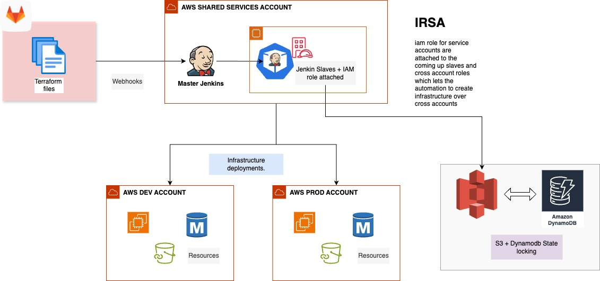

# Infrastructure Automation with GitLab, Terraform, and Jenkins in Kubernetes

## Overview

 This section  describes how to automate infrastructure provisioning using GitLab for version control and CI/CD, Terraform for infrastructure as code (IaC), and Jenkins running in a Kubernetes cluster with dynamic slaves. The Jenkins environment uses an IAM role with cross-account access to manage infrastructure across multiple AWS accounts, with the Terraform backend stored in an S3 bucket.

## Components

### 1. GitLab

- **Role**: Source control and CI/CD pipeline management.
- **Purpose**: GitLab stores the Terraform configuration files and Jenkins pipelines. It triggers Jenkins pipelines for infrastructure provisioning based on code changes or pipeline via webhooks and successful merge requessts.

### 2. Terraform

- **Role**: Infrastructure as Code (IaC) tool.
- **Purpose**: Terraform defines and provisions infrastructure resources in AWS using code. The configuration files describe the desired state of the infrastructure, and Terraform manages the creation and updates of these resources.

### 3. Jenkins

- **Role**: Continuous Integration/Continuous Deployment (CI/CD) server.
- **Purpose**: Jenkins executes the Terraform scripts for provisioning infrastructure. It runs inside a Kubernetes cluster and uses dynamic slaves for executing build jobs. The ondemand slaves are brought up by jenkins master in kubernetes podd, Jenkins pipelines are triggered by changes in GitLab webhooks.


### 4. AWS IAM Role

- **Role**: Access management.
- **Purpose**: Provides Jenkins with the necessary permissions to manage infrastructure across multiple AWS accounts. The IAM role is attached to the Jenkins service account within Kubernetes.

### 5. S3 (Simple Storage Service)

- **Role**: Backend storage.
- **Purpose**: Stores Terraform state files. This ensures that Terraform maintains a consistent view of the infrastructure across multiple deployments.

## Architecture

1. **GitLab**:
   - Hosts Terraform configuration files and Jenkins pipeline definitions.
   - Triggers Jenkins jobs based on GitLab commits or merge requests.

2. **Jenkins**:
   - Runs within a Kubernetes cluster.
   - Uses dynamic slaves (Kubernetes pods) to execute Terraform scripts.
   - Configured with an IAM role to access AWS resources across accounts.
   - Stores pipeline logs and build artifacts.

3. **Terraform**:
   - Uses configuration files to describe AWS infrastructure.
   - Backend state files are stored in S3, allowing Terraform to manage and track infrastructure changes.

4. **Kubernetes**:
   - Manages Jenkins and dynamic slaves.
   - Ensures Jenkins scalability and availability.

5. **IAM Role**:
   - Attached to the Jenkins service account.
   - Provides permissions to perform infrastructure actions across AWS accounts.

## Workflow

1. **Code Commit**:
   - Developers push Terraform configuration changes to a GitLab repository.

2. **Pipeline Trigger**:
   - GitLab triggers a Jenkins pipeline based on the changes.

3. **Terraform Execution**:
   - Jenkins retrieves the Terraform configuration from GitLab.
   - Jenkins uses dynamic slaves (Kubernetes pods) to execute Terraform scripts.
   - Terraform interacts with AWS using the IAM role attached to Jenkins.

4. **State Management**:
   - Terraform maintains state files in an S3 bucket.
   - Ensures that infrastructure provisioning is consistent and up-to-date.

5. **Infrastructure Provisioning**:
   - Terraform provisions or updates infrastructure based on the configuration.

6. **Feedback and Monitoring**:
   - Jenkins reports the status of the pipeline and any errors.
   - GitLab provides visibility into the pipeline execution and results.

## Sample Jenkinsfile

```
pipeline {
    agent none

    environment {
        AWS_REGION = 'us-east-1'
        S3_BUCKET = 'terraform-state-bucket'
        STATE_FILE = 'terraform.tfstate'
    }

    stages {
        stage('Checkout') {
            agent { label 'jenkins-master' }
            steps {
                git 'https://gitlab.com/myapp.git'
            }
        }

        stage('Terraform Init') {
            agent { label 'jenkins-slave' }
            steps {
                sh 'terraform init -backend-config="bucket=${S3_BUCKET}" -backend-config="key=${STATE_FILE}"'
            }
        }

        stage('Terraform Apply') {
            agent { label 'jenkins-slave' }
            steps {
                withAWS(credentials: 'aws-credentials-id', region: "${AWS_REGION}") {
                    sh 'terraform apply -auto-approve'
                }
            }
        }
    }

}
``` 


## Infa-automation workflow

