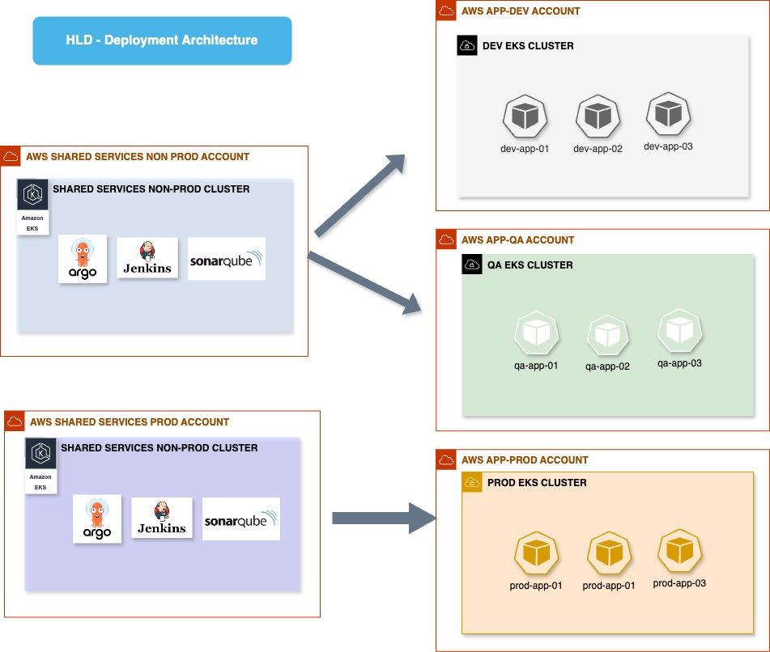

# High-Level Workflow for Microservices Deployment

## Overview

This document describes a high-level workflow for deploying microservices in a Kubernetes environment using a CI/CD pipeline. The process involves several components, including GitLab, Jenkins, Trivy, ECR, Helm, and ArgoCD, all hosted in a shared services account. The workflow ensures that code changes are automatically built, tested, and deployed in a secure and efficient manner.

## Components

### 1. **GitLab**
   - **Role**: Source Code Management
   - **Purpose**: Developers commit code to GitLab repositories. The repository holds the application code, Dockerfiles and other relevant configuration files.

### 2. **Jenkins**
   - **Role**: Continuous Integration/Continuous Deployment (CI/CD)
   - **Purpose**: Jenkins automates the process of building the application, scanning the build image, updating Helm values, and pushing changes back to GitLab.

### 3. **Trivy**
   - **Role**: Container Security Scanning
   - **Purpose**: Trivy scans the Docker images for vulnerabilities before they are pushed to the Elastic Container Registry (ECR), ensuring that only secure and only accepted low vulnerability findings of images are deployed.

### 4. **Amazon Elastic Container Registry (ECR)**
   - **Role**: Container Image Repository
   - **Purpose**: ECR stores the Docker images that Jenkins builds and scans. These images are later deployed to Kubernetes.

### 5. **Helm**
   - **Role**: Kubernetes Package Manager
   - **Purpose**: Helm manages Kubernetes applications through Helm charts. Jenkins updates Helm chart values and pushes them to GitLab, which ArgoCD then uses for deployments.

### 6. **ArgoCD**
   - **Role**: Continuous Deployment (CD)
   - **Purpose**: ArgoCD monitors the GitLab repository for changes to Helm charts and deploys the updated applications to the appropriate Kubernetes namespaces.

### 7. **SonarQube**
   - **Role**: Code Quality and Security Analysis
   - **Purpose**: SonarQube scans the code for potential bugs, vulnerabilities, and code smells before Jenkins proceeds with the build process if the quality gate conditions are met, else the build process is halted.

## High Level Workflow

### 1. **Code Commitment in GitLab**
   - **Step Description**: 
     - Developers work on feature branches and commit code changes to the GitLab repository. This repository contains the application code, Dockerfile etc.
     - A GitLab webhook triggers a Jenkins pipeline upon code commit.

### 2. **Code Build by Jenkins**
   - **Step Description**:
     - Jenkins picks up the code from GitLab and initiates a build process. The Jenkins pipeline includes steps to compile the code, run unit tests, and package the application into a Docker image.
     - Before the build is completed, SonarQube scans the code to ensure it meets the required quality and security standards. If the scan passes, Jenkins continues with the build.

### 3. **Container Image Scanning with Trivy**
   - **Step Description**:
     - Once the Docker image is built, Jenkins uses Trivy to scan the image for known vulnerabilities. Trivy checks for any security issues that could pose a threat to the application.
     - If the image passes the security scan, Jenkins pushes the Docker image to the Amazon ECR.

### 4. **Helm Values Update and Push to GitLab**
   - **Step Description**:
     - Jenkins updates the Helm chart values with the new Docker image tag or any other necessary changes (e.g., environment variables, resource limits).
     - The updated Helm chart is pushed back to the GitLab repository. This repository is monitored by ArgoCD for changes.

### 5. **Deployment with ArgoCD**
   - **Step Description**:
     - ArgoCD, hosted in the shared services account, continuously monitors the GitLab repository for changes to Helm charts.
     - When a change is detected, ArgoCD automatically synchronizes the Helm chart with the target Kubernetes cluster, deploying the updated application to the appropriate namespace.
     - The application pods are deployed into the specific namespace corresponding to the application, ensuring isolation and resource management.

## Detailed Workflow

1. **Developer Workflow**:
   - Developers clone the GitLab repository to their local machine.
   - They create a new feature branch and make the necessary code changes.
   - The code is committed and pushed to the GitLab repository, triggering the Jenkins pipeline.

2. **CI/CD Pipeline**:
   - **Jenkins Pipeline**:
     - **Stage 1**: Checkout code from GitLab.
     - **Stage 2**: Run SonarQube scan to analyze code quality and security.
     - **Stage 3**: Build the Docker image using the Dockerfile in the repository.
     - **Stage 4**: Use Trivy to scan the Docker image for vulnerabilities.
     - **Stage 5**: Push the Docker image to ECR.
     - **Stage 6**: Update Helm chart values with the new image tag.
     - **Stage 7**: Push updated Helm chart to GitLab.

3. **Deployment Workflow**:
   - **ArgoCD**:
     - Monitors the GitLab repository for Helm chart changes.
     - Automatically synchronizes the Helm chart with the Kubernetes cluster.
     - Deploys the application to the appropriate namespace within the cluster.
     - Provides feedback on the deployment status through the ArgoCD UI.

4. **Post-Deployment**:
   - The application is monitored using ArgoCD for any issues during deployment.
   - If the deployment is successful, the application runs in the target namespace, and developers can access logs and metrics for troubleshooting or performance monitoring.

  

