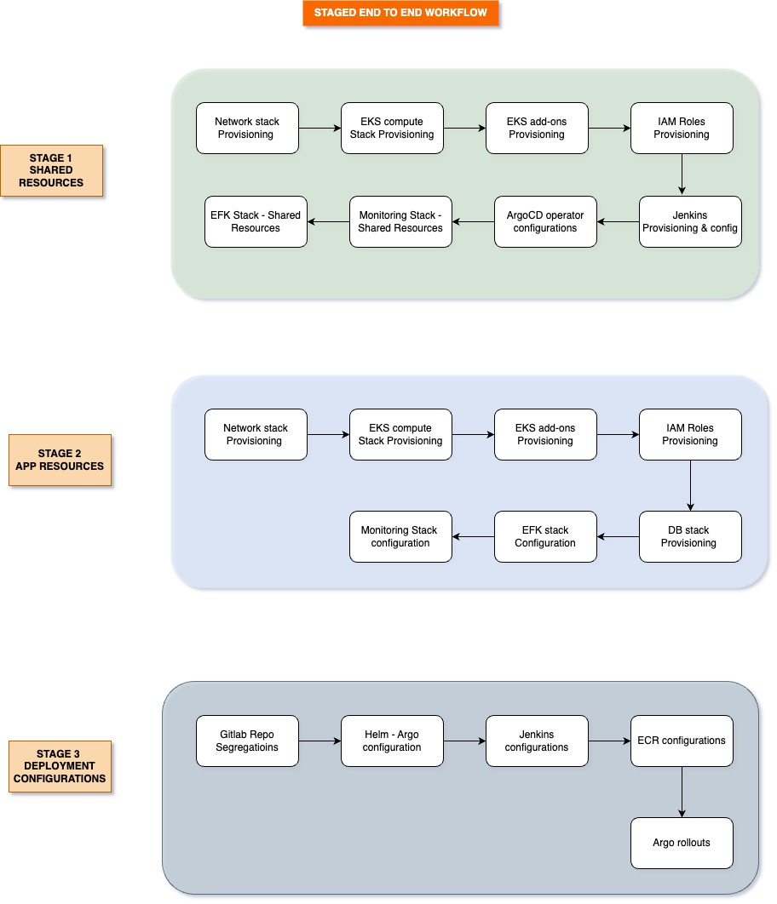

# Microservices Platform Implementation

This document provides the highlevel details of the techstack and their reasoning. Each individual components are seggregated as individual components into automations and shared-components directories and contains the relevant informations

## Table of Contents
1. [Infrastructure Platform](#infrastructure-platform)
2. [Orchestration Technology](#orchestration-technology)
3. [Infrastructure Deployment Automation](#infrastructure-deployment-automation)
4. [Microservices Deployment Automation](#microservices-deployment-automation)
5. [Release Lifecycle](#release-lifecycle)
6. [Infrastructure Testing Approach](#infrastructure-testing-approach)
7. [Monitoring - Logging Approach](#monitoring-logging-approach)

## 1. Infrastructure Platform

### Choice: **Amazon Web Services (AWS)**

**Reasoning:**
- **Highly Available:**  AWS is one of the popular public cloud providers with  wide range of out of the box services  and a well defined community support     
- **Managed Services:** AWS provides managed services for databases (RDS), container orchestration (EKS), and more, reducing the operational overhead of the engineers.
- **Security:** AWS complies with various security standards (e.g., GDPR, HIPAA), and offers security services such as AWS IAM, KMS, and GuardDuty.
- **Comprehensive Services*:** From compute and storage to databases, machine learning, and IoT, AWS provides a vast array of services to meet the demanding needs. 

## 2. Orchestration Technology

### Choice: **Kubernetes with Amazon EKS**

**Components:**
- **Amazon EKS:** Managed Kubernetes service that simplifies running Kubernetes clusters on AWS.
- **Helm:** Package manager for Kubernetes, used for managing Kubernetes resources.
- **ArgoCD:** GitOps-based continuous delivery for Kubernetes.
- **Jenkins:** Automation server for building, testing, and deploying software..

**Reasoning:**
- **Flexibility:** Kubernetes allows the deployment of microservices in containers with ease, handling deployment, scaling, and networking.
- **Fault Tolerance:** Kubernetes supports self-healing, with automatic replacement and rescheduling of failed containers.
- **Security:** Kubernetes integrates with AWS IAM for secure access and service-to-service communication along with many out of box features.
- **Autoscaling:** Kubernetes Horizontal Pod Autoscaler (HPA) and Cluster Autoscaler enable automatic scaling based on resource utilization.

## 3. Infrastructure Deployment Automation

### Tool: **Terraform**

**Reasoning:**
- **Infrastructure as Code:** Terraform allows versioning and modularization of infrastructure, enabling consistent and reproducible environments.
- **Multi-Cloud:** Terraform’s cloud-agnostic nature allows for easy migration and integration across different cloud providers, if necessary.
- **State Management:** Terraform maintains the state of the infrastructure, making it easy to track changes and roll back if necessary with S3 and DynamoDB.

## 4. Microservices Deployment Automation

**Tool:** Helm Charts with CI/CD Pipeline (e.g., GitLab CI/CD, Jenkins)

**Reasoning:**

* **Repeatability:** Helm packages the microservices as charts, making deployments repeatable and manageable.
* **Environment Customization:** Values files or Kustomize overlays allow environment-specific configurations.
* **CI/CD Integration:** GitLab CI/CD or Jenkins pipelines can be used to automate the deployment process, ensuring consistency across environments.

### 5. Release Lifecycle

#### Development
* Code is developed in feature branches and pushed to a repository.
* Automated tests run on each push to ensure quality.

#### Staging
* Feature branches are merged into the develop branch.
* A pipeline deploys the code to a staging environment for integration testing.
* Manual or automated acceptance tests are conducted.

#### Production
* Once tested and approved, code is merged into the main branch.
* The pipeline deploys the code to production.
* Canary deployments or blue-green deployments can be used to minimize risks.

#### Hot Fixes
* The hot fix is merged into both the main and develop branches to ensure consistency. It is then deployed to production via the CI/CD pipeline.

    ##### Branch Synchronization
    * After the hot fix is applied, synchronize the main and develop branches to ensure that all branches are up-to-date with the latest changes. This involves merging the hot fix into the develop branch if it was not already merged, and resolving any conflicts that may arise to maintain consistency across all branches.

#### Rollback Strategy
* Rollbacks are handled by reverting to the previous release through Helm or Terraform.

### 6. Infrastructure Testing Approach

**Tools:** Terratest

**Reasoning:**

* **Terratest:** Automates tests for Terraform configurations, ensuring infrastructure is deployed as expected. 
This concept is not covered much in the deepdive documents

### Monitoring Approach

**Tools:** Prometheus, Grafana, EFK - logging

**Reasoning:**

* **Prometheus:** Collects metrics from Kubernetes and microservices, offering real-time monitoring in an effective timeseries manner.
* **Grafana:** Visualizes metrics, enabling the creation of dashboards and alerts.
* **EFK:** EFK stack provides a robust method of logging for the entire cluster using  Elasticsearch, Fluentd and kibana

#### Stages Of Platform Automation Workflow
\
\
