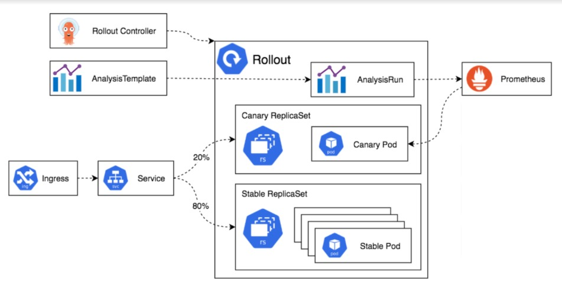

# Argo Deployment rollouts

## Overview

Argo Rollouts is a Kubernetes controller and a set of CRDs (Custom Resource Definitions) that provide advanced deployment capabilities such as blue-green deployments, canary releases, and progressive delivery features.

## Installation

Installation can be leveraged via native kubectl or via the helm charts.

#### Install via kubectl

```bash
kubectl create namespace argo-rollouts
kubectl apply -n argo-rollouts -f https://github.com/argoproj/argo-rollouts/releases/latest/download/install.yaml
```

#### Install via helm

```bash
helm repo add argo-rollouts https://argoproj.github.io/argo-helm
helm install argo-rollouts argo-rollouts/argo-rollouts --namespace argo-rollouts --create-namespace
```

## Rollout Strategies

Argo Rollouts supports several deployment strategies, Based on the application lifecycle and the requirement of environments one of the below rollout stratergy is taken into consideration.

#### 1. Canary Deployment

Canary deployment gradually shifts traffic from the current version to a new version.

```yaml
apiVersion: argoproj.io/v1alpha1
kind: Rollout
metadata:
  name: canary-rollout
spec:
  replicas: 3
  strategy:
    canary:
      steps:
        - setWeight: 20
        - pause: { duration: 10s }
        - setWeight: 40
        - pause: { duration: 10s }
  selector:
    matchLabels:
      app: my-app
  template:
    metadata:
      labels:
        app: my-app
    spec:
      containers:
        - name: my-app
          image: my-app:v2
```

#### 2. Blue-Green Deployment

Blue-green deployment maintains two environments (blue and green), and switches between them.

```yaml
apiVersion: argoproj.io/v1alpha1
kind: Rollout
metadata:
  name: blue-green-rollout
spec:
  replicas: 3
  strategy:
    blueGreen:
      activeService: my-app-active
      previewService: my-app-preview
  selector:
    matchLabels:
      app: my-app
  template:
    metadata:
      labels:
        app: my-app
    spec:
      containers:
        - name: my-app
          image: my-app:v2
```

#### 3. Progressive Delivery with Analysis

Analysis based deployment method where in the smaller proportions of traffic  being analysed and incremented. 

```yaml
apiVersion: argoproj.io/v1alpha1
kind: Rollout
metadata:
  name: canary-with-analysis
spec:
  replicas: 3
  strategy:
    canary:
      steps:
        - setWeight: 20
        - pause: { duration: 10s }
        - analysis:
            templates:
              - templateName: success-rate
        - setWeight: 40
        - pause: { duration: 10s }
  selector:
    matchLabels:
      app: my-app
  template:
    metadata:
      labels:
        app: my-app
    spec:
      containers:
        - name: my-app
          image: my-app:v2
```

#### Example Analysis Template

```yaml
apiVersion: argoproj.io/v1alpha1
kind: AnalysisTemplate
metadata:
  name: success-rate
spec:
  metrics:
    - name: success-rate
      successCondition: result > 95
      provider:
        web:
          url: "http://my-app:8080/metrics"
          jsonPath: "{$.successRate}"
```

<br>

