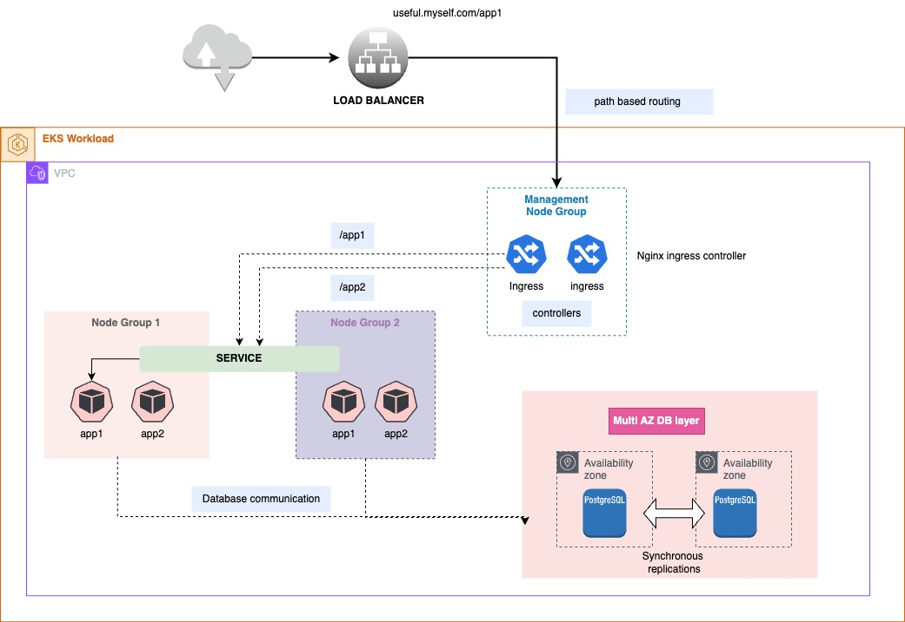
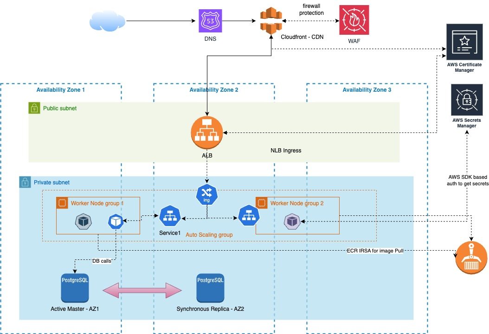

# EKS Architecture Overview

This document provides an overview of an Amazon EKS (Elastic Kubernetes Service) architecture designed for high availability, scalability, and secure management. The architecture includes various AWS services and configurations to ensure efficient operation, availability and robust security.

## Overview

The architecture leverages AWS services and Kubernetes components to deploy and manage microservices in a scalable and secure manner. Key components include Route 53 for DNS management, CloudFront for content delivery, WAF for web application security, ALB for load balancing, and a well-structured VPC setup with multiple Availability Zones (AZs).

## Components and Short Descriptions

### 1. **Route 53**
   - **Description**: AWS Route 53 provides DNS services for routing user requests to the appropriate resources. It supports routing policies and health checks to ensure high availability and reliability of applications.
   - **Role**: Routes external traffic to CloudFront and, subsequently, to the Application Load Balancer (ALB).

### 2. **CloudFront**
   - **Description**: Amazon CloudFront is a content delivery network (CDN) that caches and delivers content to end-users with low latency and high transfer speeds.
   - **Role**: Distributes content globally and provides SSL termination using AWS Certificate Manager.

### 3. **WAF (Web Application Firewall)**
   - **Description**: AWS WAF helps protect web applications from common web exploits and vulnerabilities by setting up rules to filter malicious traffic.
   - **Role**: Works with CloudFront and ALB to filter incoming requests and block threats.

### 4. **ALB (Application Load Balancer)**
   - **Description**: ALB distributes incoming application traffic across multiple targets, such as EC2 instances or containers, within one or more AZs.
   - **Role**: Routes traffic to Kubernetes services, enabling load balancing and SSL termination using AWS Certificate Manager.

### 5. **Ingress Controller**
   - **Description**: The Nginx Ingress Controller manages external access to services within the EKS cluster, routing HTTP/HTTPS requests to the appropriate services.
   - **Role**: Works with ALB and service definitions to route traffic based on defined rules and paths.

### 6. **Services and Pods**
   - **Description**: Kubernetes Services expose applications running in Pods to the network. Pods are the smallest deployable units that contain one or more containers.
   - **Role**: Services provide a stable endpoint for accessing Pods, while Pods host the application containers.

### 7. **Worker Node Groups**
   - **Description**: EKS worker nodes are grouped into three node groups across three AZs, each with varying capacities to handle different types of applications.
   - **Role**: Ensures high availability and resilience, with Horizontal Pod Autoscaling (HPA) and Cluster Autoscaler enabled for dynamic scaling.

### 8. **VPC CNI with Calico**
   - **Description**: The VPC CNI plugin provides networking for Pods in EKS, and Calico is used for advanced networking features and network policies.
   - **Role**: Facilitates pod-to-node IP configurations and implements network policies for security and segmentation.

### 9. **EBS (Elastic Block Store)**
   - **Description**: EBS provides persistent block storage for data volumes used by Pods.
   - **Role**: Stores data blocks for applications, ensuring durability and performance.

### 10. **Secrets Manager**
   - **Description**: AWS Secrets Manager stores and manages sensitive information such as API keys and database credentials.
   - **Role**: Provides a secure way to store and retrieve secrets used by applications.

### 11. **RDS (Relational Database Service) with PostgreSQL**
   - **Description**: RDS provides managed PostgreSQL databases with multi-AZ deployment for high availability and synchronous replication.
   - **Role**: Ensures high availability and durability of the database layer with automatic failover and backup capabilities.

### 12. **Certificate Manager**
   - **Description**: AWS Certificate Manager manages SSL/TLS certificates for secure communication.
   - **Role**: Handles SSL termination for ALB and WAF, ensuring encrypted connections for external traffic.

## Traffic Flow

1. **External Traffic**:
   - **User Requests**: Users access the application via HTTPS.
   - **Route 53**: Routes traffic to CloudFront.
   - **CloudFront**: Distributes content and terminates SSL/TLS connections.
   - **WAF**: Filters incoming traffic for security.
   - **ALB**: Balances load and routes traffic to the appropriate Ingress Controller.

2. **Internal Traffic**:
   - **Ingress Controller**: Routes HTTP/HTTPS requests to Kubernetes Services.
   - **Services**: Directs traffic to the Pods based on defined service selectors.

3. **Pod Communication**:
   - **Pods**: Communicate internally within the cluster using HTTP.
 

## Authentication and Connection to RDS and Secrets Manager

1. **Secrets Manager**:
   - **Usage**: Store sensitive information such as database credentials.
   - **Access**: Applications and services use AWS SDKs to securely retrieve secrets from Secrets Manager.

2. **RDS Connection**:
   - **Usage**: PostgreSQL database connections are managed through RDS.
   - **Access**: Pods access the RDS instance using credentials retrieved from Secrets Manager.

3. **ECR Connection**:
   - **Usage**: elastic container registry to store the images
   - **Access**: Kubelet pulls the images based on the IRSA associated with the nodes to access the ECR.

4. **IAM Roles**:
   - **Role**: EKS worker nodes and services use IAM roles with the appropriate permissions to access Secrets Manager and RDS.

## High Availability, Resilience, and Security in EKS Architecture

### High Availability

High availability is achieved through several key components in the EKS architecture:

- **Multi-AZ Worker Nodes**: The EKS worker nodes are distributed across three Availability Zones (AZs). This distribution ensures that if one AZ experiences issues, the other AZs can continue to handle traffic and workloads, minimizing downtime.
  
- **Multi-AZ RDS Deployment**: The PostgreSQL database is deployed with multi-AZ support, which provides automatic failover and synchronous replication. This setup ensures that the database remains accessible even if one availability zone encounters a failure.

- **Horizontal Pod Autoscaling (HPA) and Cluster Autoscaler**: HPA automatically adjusts the number of pod replicas based on the current load, while the Cluster Autoscaler dynamically scales the number of worker nodes in response to the overall cluster demand. This ensures that the application can handle varying loads and maintain performance.

### Resilience

Resilience is built into the architecture through:

- **Pod Distribution**: Pods are distributed across different worker node groups and AZs, which mitigates the risk of a single point of failure affecting the entire application. If a pod fails or a node goes down, other pods in different nodes or AZs can continue to operate normally.

- **Elastic Block Store (EBS)**: EBS volumes provide persistent block storage that ensures data durability and availability. Even if a pod or node fails, the data remains intact and can be reattached to new or replacement pods.

- **Deployment Strategies**: Rolling updates and blue-green deployments can be employed to ensure smooth application updates with minimal disruption. These strategies allow for testing new versions of the application before fully committing to them, reducing the impact of potential issues.

### Security

The security of the EKS architecture is enhanced through:

- **Network Security**: The use of AWS WAF (Web Application Firewall) and Security Groups (SGs) helps protect the application from malicious traffic and unauthorized access. WAF filters and monitors HTTP/HTTPS requests, while Security Groups define inbound and outbound traffic rules for instances.

- **IAM Roles and Policies**: IAM roles and policies control access to AWS resources. The EKS worker nodes and applications use specific IAM roles with limited permissions to access only the necessary resources, adhering to the principle of least privilege.

- **Secrets Management**: AWS Secrets Manager securely stores and manages sensitive information such as database credentials. Applications and services retrieve these secrets programmatically using AWS SDKs, ensuring that sensitive data is not exposed in plain text or configuration files.

- **SSL/TLS Encryption**: SSL/TLS certificates managed by AWS Certificate Manager are used to encrypt data in transit. CloudFront and ALB handle SSL termination, ensuring that external communication is secure.

---