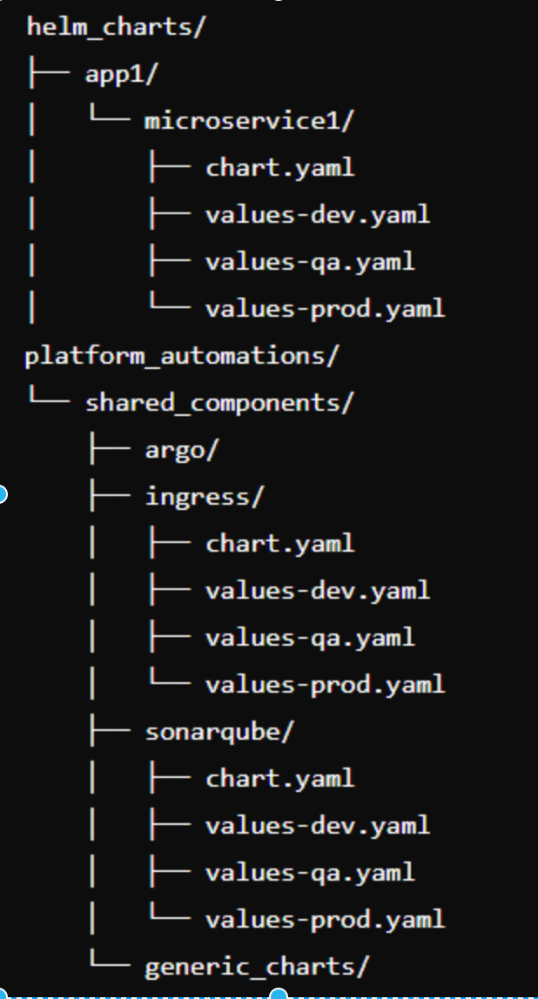

## Jenkins scripts and configurations
  

#### Gitlab repo structure for jenkins
  

1. **helm_charts/**:  
    - This is the root directory where all Helm charts for your applications are stored.  
    
    
    - **app1/**:  
    - Represents a specific application within your project.  
    
    - **microservice1/**:  
    - Contains Helm charts specific to this microservice under `app1`.  
    - **chart.yaml**: The main chart definition file for the microservice. It contains metadata about the chart, such as its name, version, and dependencies.  
    - **values-dev.yaml**: Configuration values specific to the development environment.  
    - **values-qa.yaml**: Configuration values specific to the QA environment.  
    - **values-prod.yaml**: Configuration values specific to the production environment.  
    
  
2. **platform_automations/**:  
    - This directory is for automation scripts and charts that are used across the platform.  
    
    - **shared_components/**:  
        - Houses shared components used by multiple services or across environments.  
        
    - **argo/**:  
        - A directory dedicated to configurations or scripts related to Argo, a continuous delivery tool for Kubernetes.  
  
  
    - **ingress/**:  
        - Contains Helm charts and environment-specific values for managing ingress resources.  
        - **chart.yaml**: Main chart file for the ingress component.  
        - **values-dev.yaml**: Values for ingress in the development environment.  
        - **values-qa.yaml**: Values for ingress in the QA environment.  
        - **values-prod.yaml**: Values for ingress in the production environment.  
  
  
    - **sonarqube/**:  
        - Contains Helm charts and environment-specific values for managing SonarQube, a tool for continuous inspection of code quality.  
        - **chart.yaml**: Main chart file for the SonarQube component.  
        - **values-dev.yaml**: Values for SonarQube in the development environment.  
        - **values-qa.yaml**: Values for SonarQube in the QA environment.  
        - **values-prod.yaml**: Values for SonarQube in the production environment.  
    
  
    - **generic_charts/**:  
        - A directory to host reusable Helm charts for various applications. This directory helps inject dependencies across multiple services, streamlining the deployment process.  
  
  
    - **jenkins-ci-scripts/**:  
        - Contains scripts used for Jenkins shared libraries and jobs.  
  
    - **src/com/myapps/utils/**:  
        - Utilities directory for Groovy scripts that handle tasks like building container images and pushing them to a registry.  
    
    - **vars/**:  
        - Stores various Groovy scripts that are used as shared libraries in Jenkins jobs.  
        - **build_controller.groovy**: A controller script for parsing information such as Git branches, repositories, and registry details. This script orchestrates the build process based on the parsed data.  
        - **image_build.groovy**: A script that builds container images using tools like Kaniko or Crane, tags them, and pushes them to the specified container registry.  
        - **gitOperations.groovy**: A script responsible for updating Helm charts by parsing YAML files and committing changes to the Helm charts repository. It automates the versioning and deployment of Helm charts based on the application and environment.  
  
  
    - **resources/**:  
        - Contains resource files used by the Groovy scripts.  
    - **build_controller.yaml**: A YAML file containing information about Helm repositories, applications, registries, and branching strategies. This file is invoked by utility scripts to guide the build and deployment processes.  
  
  
    - **build_push.groovy**: The main controller script invoked by Jenkins. It handles scanning the code, building container images, and pushing them to the registry.  
  
  
    - **image_promoter.groovy**: Script for promoting container images to higher environments (e.g., from QA to production). This script ensures that images are re-tagged and pushed to the appropriate repositories to prevent redundant builds in staging or production environments.

## Jenkins deployment Workflow

