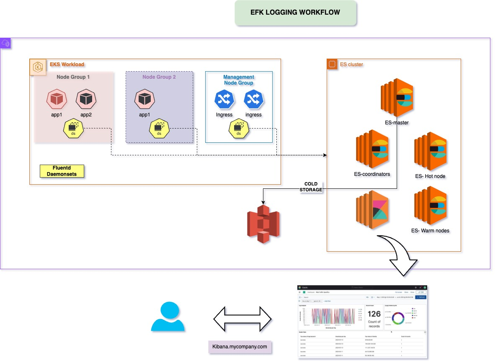

# EFK Stack with Fluentd, Elasticsearch, and Kibana

## Overview

The EFK stack is a powerful logging solution that comprises three main components: **Elasticsearch**, **Fluentd**, and **Kibana**. In this setup, Fluentd collects logs from the stdout of Kubernetes pods and sends them directly to Elasticsearch, which stores and indexes the logs. Kibana is then used for visualizing and querying the log data.

### Components

1. **Fluentd**:
   - **Role**: Log Aggregator.
   - **Deployment**: Deployed as a DaemonSet within the Kubernetes cluster, ensuring that an instance of Fluentd runs on each node to collect logs from all pods.
   - **Functionality**: Fluentd reads logs from the stdout of each pod and forwards them directly to Elasticsearch. It is configured to use SSL with certificates for secure communication with Elasticsearch.
   - **SSL Configuration**: Internal certificates are distributed across all Fluentd instances to ensure secure communication.

2. **Elasticsearch**:
   - **Role**: Log Storage and Indexing.
   - **Deployment**: A highly available and resilient setup with nodes spread across multiple availability zones (AZs).
     - **Master Nodes**: 3 nodes, each in a different AZ, responsible for cluster management and coordination.
     - **Coordinator Nodes**: 2 nodes, to reduce the load on master and data nodes by handling query processing and forwarding requests.
     - **Hot Nodes**: 2 nodes with high specifications, used for storing and indexing the most recent and frequently accessed log data.
     - **Warm Nodes**: 3 nodes with lower specifications, used for storing older logs that are accessed less frequently.
   - **SSL Configuration**: All nodes in the Elasticsearch cluster communicate over SSL using internally distributed certificates.

3. **Kibana**:
   - **Role**: Data Visualization and Query Interface.
   - **Deployment**: Hosted on a separate node, Kibana connects to Elasticsearch to provide a user interface for querying, analyzing, and visualizing log data.
   - **SSL Configuration**: Kibana is configured to communicate securely with Elasticsearch using SSL.

## Workflow

1. **Log Collection**:
   - Fluentd, running as a DaemonSet, collects logs from the stdout of each pod in the Kubernetes cluster. This ensures that all logs generated by the applications running in the cluster are captured in real-time.

2. **Log Forwarding**:
   - Fluentd forwards the collected logs to Elasticsearch. The communication between Fluentd and Elasticsearch is secured using SSL with certificates, ensuring that log data is transmitted securely.

3. **Log Storage and Indexing**:
   - Elasticsearch receives the logs from Fluentd, stores them in its indices, and makes them available for querying and analysis. The logs are initially stored in the hot nodes for quick access and later moved to the warm nodes for long-term storage.

4. **Log Visualization**:
   - Kibana provides a web-based interface for querying the logs stored in Elasticsearch. Users can create dashboards, visualize trends, and analyze log data to gain insights into application performance and troubleshoot issues.

## High Availability (HA) and Resiliency

The described EFK stack architecture is designed for high availability and resiliency:

- **Elasticsearch**:
  - **Master Nodes**: The three master nodes are spread across three different AZs, ensuring that the cluster can remain operational even if one AZ fails.
  - **Coordinator Nodes**: The two coordinator nodes help distribute the query load, preventing any single node from becoming a bottleneck.
  - **Hot and Warm Nodes**: The separation of hot and warm nodes allows for efficient resource utilization, with high-spec nodes handling intensive indexing operations and lower-spec nodes managing less frequently accessed data.
  - **Data Replication**: Elasticsearch can replicate data across multiple nodes and AZs, ensuring that the data is not lost even in case of hardware failure.
  - **Cold storage**: Elasticsearch plugin with S3 can be added to enchance the log to cold archival process along with S3. this can further be improved by using S3 glacier for very old data with 8+ hours of retrieval

- **Fluentd**:
  - **DaemonSet Deployment**: Fluentd runs on every node in the Kubernetes cluster, ensuring that logs are collected from all pods, regardless of where they are running. This deployment strategy also provides redundancy, as the failure of a single Fluentd instance does not impact the overall log collection.

- **Kibana**:
  - **Dedicated Node**: By hosting Kibana on a separate node, the performance of the visualization and query interface is not impacted by the Elasticsearch nodes' operations.

## Potential Improvements with Kafka Integration

The current architecture can be enhanced by introducing Kafka as a buffering and streaming layer between Fluentd and Elasticsearch:

- **Decoupling Log Collection and Ingestion**:
  - By sending logs to Kafka instead of directly to Elasticsearch, Fluentd can decouple log collection from log ingestion. This helps in scenarios where Elasticsearch is under heavy load or temporarily unavailable.

- **Improved Resiliency**:
  - Kafka can provide buffering capabilities, ensuring that logs are not lost during Elasticsearch downtimes. Once Elasticsearch becomes available, logs can be consumed from Kafka and ingested into Elasticsearch.

- **Scalability**:
  - Kafka’s ability to handle high throughput and partition data allows for better scalability of the log processing pipeline. Logs can be processed and ingested in parallel by multiple consumers.

- **Additional Processing**:
  - Integrating Kafka opens up possibilities for additional log processing steps before ingestion into Elasticsearch, such as log filtering, enrichment, or transformation.

### **Workflow with Kafka Integration**

1. **Log Collection**:
   - Fluentd collects logs from the stdout of each pod and sends them to Kafka instead of Elasticsearch.

2. **Log Buffering and Streaming**:
   - Kafka stores the logs in a distributed and fault-tolerant manner. It acts as a buffer and ensures logs are retained for a configured period.

3. **Log Ingestion**:
   - One or more consumers read logs from Kafka and send them to Elasticsearch for storage and indexing.

4. **Log Visualization**:
   - Kibana remains the interface for querying and visualizing the logs stored in Elasticsearch.

---