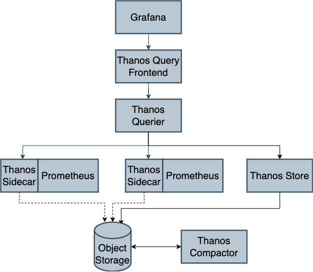
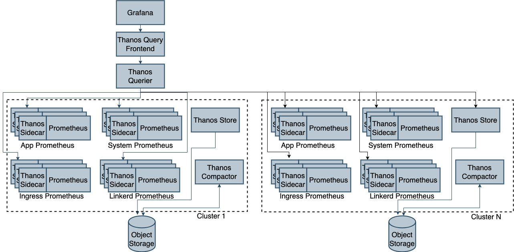

# Prometheus and Thanos Monitoring Stack

## Overview

### Prometheus

Prometheus is an open-source systems monitoring and alerting toolkit, purpose-built for reliability in monitoring dynamic cloud environments. It collects metrics from defined targets at regular intervals, stores them locally, runs rules over this data to either aggregate or generate alerts, and allows for flexible queries to understand how systems are behaving.

##### Key Features:

- **Multidimensional Data Model:** Prometheus stores data in a time-series database, which is structured as a multi-dimensional data model, allowing for flexible and detailed queries.
- **PromQL:** A powerful query language designed to leverage the multi-dimensional nature of the data.
- **Alerting:** Prometheus supports alerting based on metrics and rules, which can be sent to different channels via Alertmanager.

### Thanos

Thanos extends Prometheus by adding highly available, scalable, and long-term storage capabilities. It enables a global view across multiple Prometheus instances and facilitates efficient querying of historical data, stored in cloud object storage.

##### Key Features:

- **Global Querying:** Aggregates data from multiple Prometheus instances into a single queryable view.
- **Long-Term Storage:** Offloads data from Prometheus to object storage (e.g., S3, GCS) for cost-effective long-term storage.
- **High Availability:** Provides fault-tolerance and scalability by enabling redundant Prometheus setups.

## Monitoring Components

### Prometheus

##### 1. Prometheus Server

**Role:** The heart of the Prometheus system, responsible for collecting and storing metrics data, executing rules, and responding to queries.
**Responsibilities:**

- **Scraping:** Collects metrics data from configured targets, such as applications, databases, and services.
- **Storage:** Stores the scraped data in a time-series database optimized for high throughput.
- **Querying:** Provides an API and UI for querying data using PromQL, a powerful query language for time-series data.
- **Rule Evaluation:** Continuously evaluates alerting and recording rules to generate alerts or precompute frequently needed query results.

##### 2. Alertmanager

**Role:** Manages alerts generated by Prometheus rules and routes them to the appropriate receivers.
**Responsibilities:**

- **Alert Grouping:** Groups similar alerts into a single notification to avoid alert fatigue.
- **Deduplication:** Ensures that duplicate alerts are suppressed.
- **Routing:** Sends alerts to the correct channels (e.g., email, Slack, PagerDuty) based on pre-configured routing rules.
- **Silencing:** Allows operators to temporarily silence certain alerts during maintenance or other planned activities.

##### 3. Exporters

**Role:** Components that translate metrics from various systems into the format Prometheus understands.
**Responsibilities:**

- **Metrics Exposure:** Exporters collect and expose metrics via HTTP, making them available for Prometheus to scrape.
- **Custom and Standard Exporters:** Includes both standard exporters for common systems (e.g., Node Exporter for Linux system metrics) and custom exporters for specialized or proprietary systems.

##### 4. Pushgateway

**Role:** Facilitates the collection of metrics from short-lived jobs that cannot be scraped directly by Prometheus.
**Responsibilities:**

- **Push Model:** Allows applications or scripts to push metrics to Pushgateway.
- **Exposing Metrics:** Pushgateway then exposes these metrics for Prometheus to scrape, ensuring that short-lived jobs are captured in monitoring data.

### Thanos Components

##### 1. Thanos Sidecar

**Role:** A lightweight process that runs alongside Prometheus, enabling data to be offloaded to a long-term storage backend and facilitating querying across multiple Prometheus instances.
**Responsibilities:**

- **Data Upload:** Periodically uploads metrics from Prometheus to an object store, ensuring data is available for long-term storage.
- **Query API:** Exposes an API that allows Thanos Query to fetch both local and historical data from Prometheus.

##### 2. Thanos Store Gateway

**Role:** Allows Thanos Query to access historical data stored in an object store in our case as S3.
**Responsibilities:**

- **Data Retrieval:** Serves data from object storage, making it available for querying through Thanos Query.
- **Caching:** Implements caching mechanisms to optimize query performance for frequently accessed data.

##### 3. Thanos Query

**Role:** Aggregates metrics from multiple Prometheus instances and Thanos components, providing a unified interface for querying.
**Responsibilities:**

- **Global View:** Combines data from multiple Prometheus instances and object storage into a single queryable view.
- **Deduplication:** Handles deduplication of metrics that may be present in multiple Prometheus instances.
- **UI and API:** Provides a user interface and API for executing PromQL queries against the aggregated data.

##### 4. Thanos Compact

**Role:** Optimizes storage usage by compacting and downsampling time-series data stored in object storage.
**Responsibilities:**

- **Compaction:** Reduces the number of individual blocks of data by compacting them into larger, more efficient blocks.
- **Downsampling:** Aggregates older data at lower resolutions, reducing storage costs while still providing valuable insights for historical data.

##### 5. Thanos Ruler

**Role:** Evaluates Prometheus-style rules on historical data stored in Thanos, enabling continuous alerting and recording even across long-term data.
**Responsibilities:**

- **Rule Evaluation:** Continuously evaluates rules and generates alerts based on historical data.
- **Recording Rules:** Allows for precomputing and storing frequently used queries, optimizing performance for common queries.

## Monitoring Workflow

#### Step 1: Deploy Prometheus

- Begin by setting up Prometheus to monitor your infrastructure. Configure scrape targets, alerting rules, and exporters.
- Ensure Alertmanager is properly set up to manage and route alerts.

#### Step 2: Integrate Thanos Sidecar

- Deploy Thanos Sidecar alongside each Prometheus instance to enable the seamless transfer of metrics to long-term storage.
- Verify that metrics are being uploaded to the configured object store and that the Sidecar is operational.

#### Step 3: Global Querying with Thanos Query

- Deploy Thanos Query to aggregate and deduplicate metrics across all Prometheus instances and object storage.
- Use the Thanos Query UI to execute global queries and confirm that all data sources are integrated correctly.

#### Step 4: Optimize Data with Thanos Compact

- Use Thanos Compact to manage storage costs by compacting time-series data and downsampling older data. This ensures efficient use of storage resources while maintaining the ability to query historical data.

#### Step 5: Enable Global Rule Evaluation with Thanos Ruler

- Deploy Thanos Ruler to evaluate Prometheus-style rules on the global dataset. This allows for more comprehensive alerting and recording based on data from multiple Prometheus instances.

#### Step 6: Monitor and Maintain

- Continuously monitor the performance of your Prometheus and Thanos setup. Ensure that object storage, query performance, and alerting are functioning as expected.
- Regularly update your alerting and recording rules as your infrastructure evolves.
- Other components like linkerd if implemented can betaken into considerations of monitoring

 

 
 

